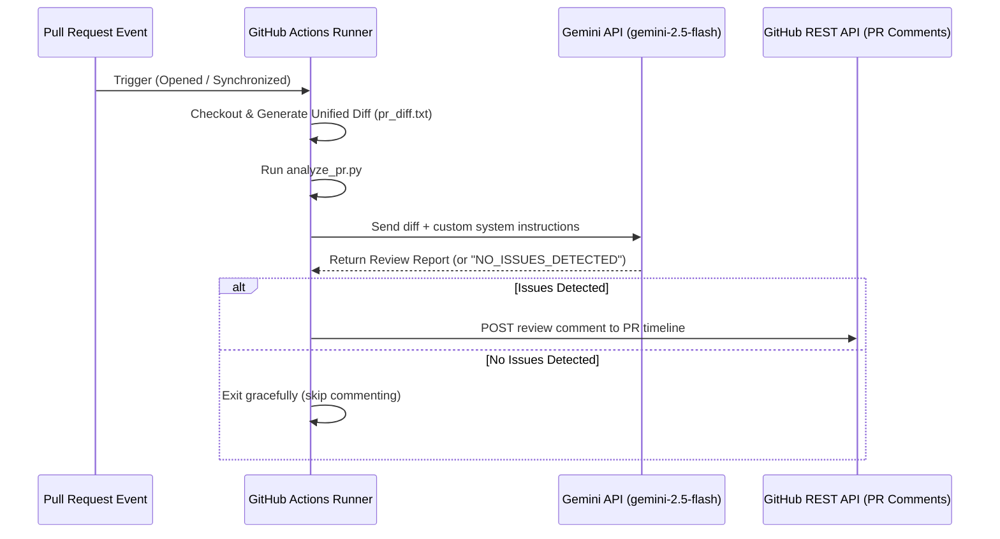

# Gemini PR Code Reviewer Integration Guide

This repository contains an automated code reviewer powered by Google Gemini to analyze Motorola 6809 / Hitachi 6309 assembly code and NitrOS-9 kernel architecture rules.

## File Locations

* **GitHub Actions Workflow**: [.github/workflows/gemini-pr-review.yml](../workflows/gemini-pr-review.yml)
* **Gemini Analysis Script**: [.github/scripts/analyze_pr.py](../scripts/analyze_pr.py)
* **Test Cases**: Located in this directory (`tests/pr_reviewer/`)

---

## How the Tool Works



### Review Rules Enforced by Gemini
The system instructions are configured to analyze:
1. **General Assembly Bug Detection**: Register clobbering (missing `PSHS`/`PULS`), missing returns (`RTS`/`RTI`), and missing OS-9 error checks (using `BCS`/`BCC` after system calls).
2. **Repository-Specific rules (from `.ai_assembly_rules.md`)**:
   - Mandating `TFM` block copies for 6309 target paths.
   - Requiring unrolled 5-bit offsets (`LDD n,Y` / `STD n,X`) for 6809 small buffer copies ≤ 16 bytes.
   - Enforcing `ORCC #$50` / `ANDCC #$AF` flags for stack blast routines using `LDS`.
   - Backward pointer calculations for overlapping blocks (Source < Destination).
3. **NitrOS-9 System Call Reference Notes**: Specifying entry and exit registers for key system calls like `F$Link` and `F$Fork`.

---

## Required GitHub-Side Configuration

To make this workflow run successfully, configure the following settings in your repository on GitHub:

### Step 1: Secure and Save the Gemini API Key
1. Obtain an API Key from [Google AI Studio](https://aistudio.google.com/). The free tier for `gemini-2.5-flash` is perfect for this use case.
2. On your GitHub repository page, navigate to **Settings** > **Secrets and variables** > **Actions**.
3. Click **New repository secret**.
4. Set the name to `GEMINI_API_KEY`.
5. Paste your API Key in the secret value box and click **Add secret**.

### Step 2: Grant Write Permissions to Workflow Tokens
The automatic `GITHUB_TOKEN` generated for workflows needs write access to post comments on the Pull Request:
1. Navigate to **Settings** > **Actions** > **General**.
2. Scroll down to the **Workflow permissions** section.
3. Select **Read and write permissions**.
4. Click **Save**.

---

## 🧪 Testing Framework for PR Review Validation

To verify that the reviewer correctly approves valid code and flags violations, use the five test cases in this directory:

1. **`case_pass.asm`**: A fully optimized, valid assembly code snippet that should pass the reviewer checks without posting any comments (registers are saved, proper return, and correct offset usage).
2. **`case_fail_register_clobber.asm`**: Modifies `X` and `Y` without preserving them. Should trigger a warning for **Register Clobbering**.
3. **`case_fail_missing_return.asm`**: A subroutine lacking `RTS`/`RTI`. Should trigger a warning for **Missing Returns**.
4. **`case_fail_os9_carry.asm`**: Performs an `os9 F$Link` call but fails to check the Carry flag immediately after. Should trigger a warning for **OS-9 Error Handling**.
5. **`case_fail_rules_violation.asm`**: Uses a loop copy for small buffers (instead of 5-bit offsets) and omits `ORCC #$50` in a stack-blast block. Should trigger a warning for **Repository-Specific Rules**.

### How to Run the Tests on GitHub:

#### Test Case A: Validate the Passing PR
1. Create a new branch:
   ```bash
   git checkout -b test/pr-pass
   ```
2. Commit the passing test file:
   ```bash
   git add tests/pr_reviewer/case_pass.asm
   git commit -m "test: add passing assembly code case"
   git push origin test/pr-pass
   ```
3. Open a Pull Request from `test/pr-pass` to `main`.
4. **Expected Result**: The GitHub Action runs, outputting `Gemini found no severe bugs. Skipping PR comment.` in the logs. No comment is posted on the PR timeline.

#### Test Case B: Validate the Failing PRs
1. Create a new branch:
   ```bash
   git checkout -b test/pr-fail
   ```
2. Commit one or more of the failing test files:
   ```bash
   git add tests/pr_reviewer/case_fail_*.asm
   git commit -m "test: add failing assembly code cases"
   git push origin test/pr-fail
   ```
3. Open a Pull Request from `test/pr-fail` to `main`.
4. **Expected Result**: The GitHub Action runs, calls Gemini, and posts a comment on the PR timeline pointing out the specific issues in each file.
